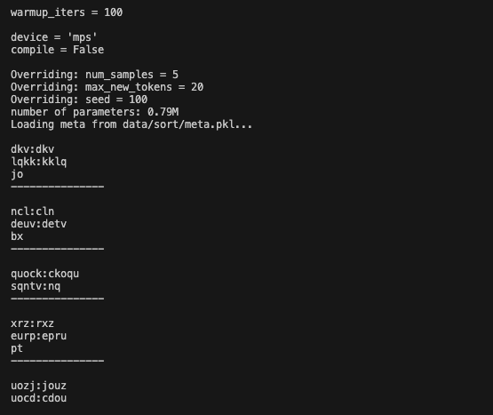
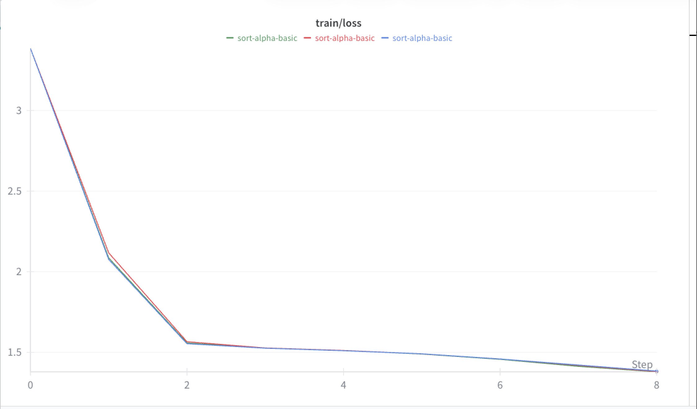

# Alphabetic Sorting Experiment

Train a character-level GPT to sort strings of characters alphabetically.

## Task
Map a random string to its sorted version:
*   Input: `dcba:` -> Target: `abcd`

## Experiment Log

### Run 1: Variable Length Sorting
**Purpose:** distinct character sorting on strings of length 3-5.

**Config:**
- `dataset`: sort (generated by `prepare.py`)
- `max_iters`: 2000
- `device`: mps
- `n_layer`: 4, `n_head`: 4, `n_embd`: 128

**Results:**
- **Final Train Loss**: ~1.38
- **Final Val Loss**: ~1.64
- **Performance**: The model successfully learned the sorting logic. It correctly sorts most short strings, though occasionally makes minor errors on longer or more complex inputs.

**Sample Output:**
*(Paste your terminal screenshot here, or use the text below)*

```
dkv:dkv         (Correct)
ncl:cln         (Correct)
quock:ckoqu     (Correct - 'c' moved to front)
lqkk:kklq       (Correct)
deuv:detv       (Error: hallucinated 't')
```

## WandB Training Graphs


**Observations:**
*   The **train/loss** graph demonstrates high stability, with all runs following an identical learning trajectory.
*   The curve shows a sharp initial drop (learning output format) followed by steady refinement of sorting logic.
